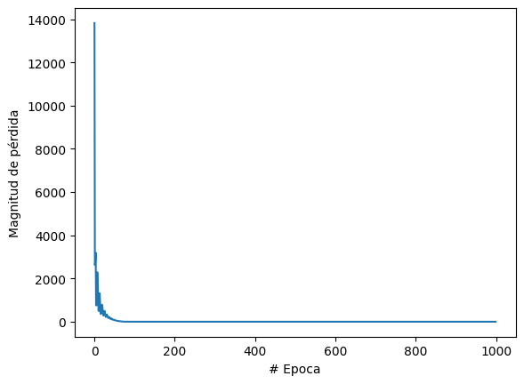
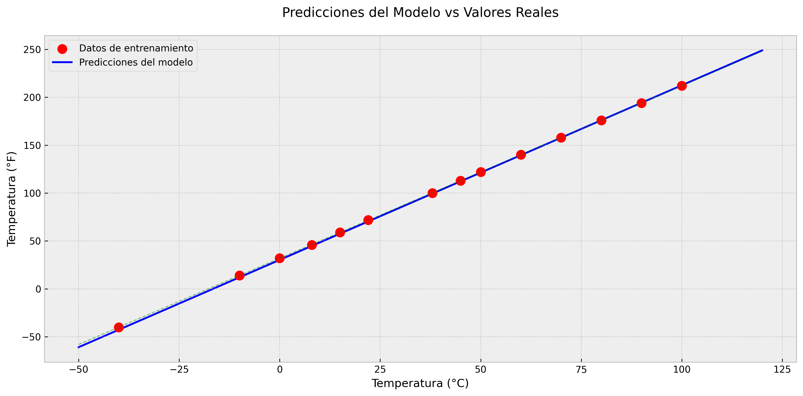

# Práctica: Redes Neuronales Artificiales

## Objetivo
Aplicar los conceptos relacionados con las Redes Neuronales Artificiales (RNA) como uno de los paradigmas utilizados en el aprendizaje automático o aprendizaje de máquina (Machine Learning).

## Fundamento Teórico

Las redes neuronales artificiales son modelos simples del funcionamiento del sistema nervioso. Como define IBM (2021):

> Las redes neuronales artificiales son modelos simples del funcionamiento del sistema nervioso. Las unidades básicas son las neuronas, que generalmente se organizan en capas. Una red neuronal es un modelo simplificado que emula el modo en que el cerebro humano procesa la información: Funciona por el trabajo simultáneo de un número elevado de unidades de procesamiento interconectadas que parecen versiones abstractas de neuronas.

### Estructura de una Red Neuronal
- **Capa de entrada**: Recibe los datos de entrada
- **Capas ocultas**: Procesan la información
- **Capa de salida**: Produce el resultado final
- **Pesos y sesgos**: Se ajustan durante el entrenamiento

## Actividades Realizadas

### Actividad 1: Red Neuronal Simple
Implementación de una red neuronal con una capa de entrada y una de salida para convertir temperaturas.

#### Componentes:
- Capa de entrada: 1 neurona
- Capa de salida: 1 neurona
- Función de activación: Lineal
- Optimizador: Adam (tasa de aprendizaje: 0.1)

#### Código Implementado:
```python
import tensorflow as tf
import numpy as np

# Datos de entrenamiento
centigrados = np.array([-40, -10, 0, 8, 15, 22, 38], dtype=float)
fahrenheit = np.array([-40, 14, 32, 46, 59, 72, 100], dtype=float)

# Modelo
capa = tf.keras.layers.Dense(units=1, input_shape=[1])
modelo = tf.keras.Sequential([capa])
```

### Actividad 2: Red Neuronal con Capas Ocultas
Modificación del modelo para incluir dos capas ocultas de 3 neuronas cada una.

#### Componentes:
- Capa de entrada: 1 neurona
- Primera capa oculta: 3 neuronas
- Segunda capa oculta: 3 neuronas
- Capa de salida: 1 neurona

### Actividad 3: Red Neuronal Expandida
Implementación de un modelo más complejo con más datos y capas.

#### Datos de Entrenamiento:
- Temperaturas Celsius: [-40, -10, 0, 8, 15, 22, 38, 45, 50, 60, 70, 80, 90, 100]
- Temperaturas Fahrenheit: [-40, 14, 32, 46, 59, 72, 100, 113, 122, 140, 158, 176, 194, 212]

## Resultados

### Gráficos del Modelo

#### Pérdida Durante el Entrenamiento

Este gráfico muestra la disminución del error durante el entrenamiento, indicando una mejora continua en la precisión del modelo.

#### Predicciones vs Valores Reales

Comparación entre las predicciones del modelo y los valores reales, demostrando la precisión del modelo en diferentes rangos de temperatura.

### Análisis de Resultados
1. El modelo logró aprender efectivamente la relación entre temperaturas Celsius y Fahrenheit
2. La función de pérdida muestra una convergencia satisfactoria
3. Las predicciones son precisas dentro del rango de entrenamiento

## Conclusiones

1. Las redes neuronales demostraron ser efectivas para aprender relaciones matemáticas, incluso con arquitecturas simples
2. El uso de TensorFlow y Keras facilita la implementación de modelos de redes neuronales
3. La elección de hiperparámetros (tasa de aprendizaje, número de épocas) es crucial para el éxito del entrenamiento
4. El modelo muestra mejor desempeño dentro del rango de datos de entrenamiento

## Requisitos

- Python 3.x
- TensorFlow
- NumPy
- Matplotlib

## Instalación

1. Clonar el repositorio
2. Crear un entorno virtual:
   ```bash
   python -m venv .venv
   ```
3. Activar el entorno virtual:
   ```bash
   source .venv/bin/activate  # En Linux/Mac
   ```
4. Instalar las dependencias:
   ```bash
   pip install tensorflow numpy matplotlib
   ```

## Uso

1. Activar el entorno virtual
2. Abrir los notebooks con Jupyter:
   ```bash
   jupyter notebook
   ```
3. Ejecutar las celdas en orden

## Referencias

### Bibliografía
Del Brío, B. M., & Sanz, A. (2006). *Redes neuronales y sistemas borrosos* (3a ed.). Editorial Ra-Ma.

### Direcciones Electrónicas
Amaya, L. (s.f.). Redes NEURALES - curso- Fundamentos - luisamayateacher. Google Sites. https://sites.google.com/site/luisamayateacher/redes-neurales---curso

Barragán, A. (2020, 1 de septiembre). ¿Qué es Una red neuronal artificial? CEBE Belgica. https://cebebelgica.es/es_ES/blog/10/que-es-una-red-neuronal-artificial.html

Documentos de IBM. (2021). IBM - Estados Unidos. https://www.ibm.com/docs/es/spss-modeler/SaaS?topic=networks-neural-model

RingaTech. (s.f.). Tu primera red neuronal en Python y Tensorflow [Video]. Youtube. https://www.youtube.com/watch?v=iX_on3VxZzk
